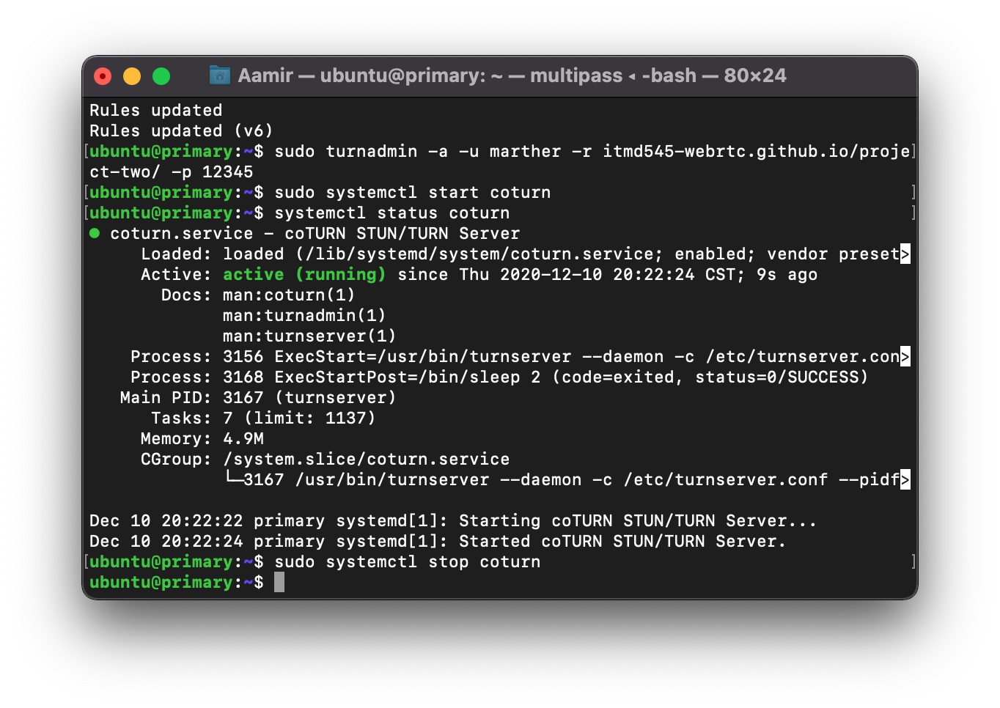

# Future Improvements Plan:

Our team is happy with the place our project is at, however, we still have many ideas on how we can further improve it. First, and probably the simplest, is to direct the users to a pre-join page. This is where users can make adjustments to their input devices and see a preview of themselves on camera. Currently, we don't transmit audio during the call so this is something we would work on in the future, as well. Before and during the call, we'd also like to give users the capability to enable and disable their microphone or camera.

Next, we would like to implement multiple-peer connections where participants can join one room to connect with one another and be able to have a video call and chat. This will require the project to have more advanced logic to enable interchangeable connecting peers.

Another cool feature we would have in a muti-peer connection setting, is that any user will be able choose who to send chat messages to (i.e. a specific peer or a group of peers or everyone in the room). Having more than 2 people in the room creates a challenge for the connect four game, as it is a 2 player game. Therefore, to initiate the game in such a scenario we would need to implement restrictions where the game can only start when player 1 starts the game, invites another peer or peers and when the 2nd player (whichever peer accepts the game invite 1st) joins the game will only then the game will start. This means the rest of the peers in the room will be able to do the same so long they have a peer to play with, and as for the instance of having odd number of users in the room, maybe we would also want the last peer, who has no one left they could play with can start a game with a bot as player 2.

Currently the users are only able to share their audio and video stream from their camera and microphone but, onwards we would also like them to be able to share any information using the share screen feature. The share screen feature can be really useful as users can share any tabs, windows and documents on their desktop. The sharing feature will be controlled by the host and the host will decide as to who can share as part of their host controls.

Additionally we also want to implement a pre join screen where users will be able to check and test their video and audio streams. This will allow them to prepare and check if their camera output is correct and also test if the audio and microphone are connected properly to which they prefer. Lastly but most importantly, we also want the users to be able to turn off their video and audio at any given time. In other words, have a mute feature for the audio and video.

